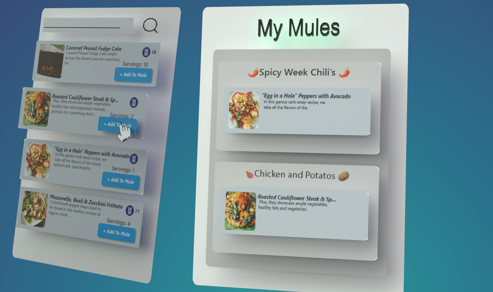
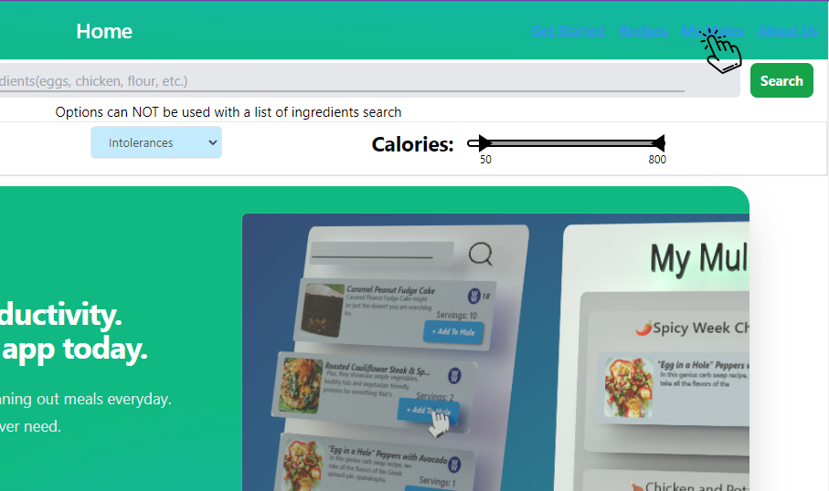
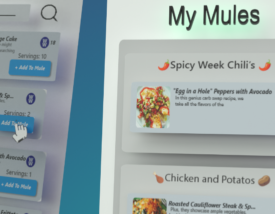

# Read Me Generator

## Description 
A Simple CLI for generating a README.md file that will fill out all the nessesary and proper sections of the readme. Some of the usage and installation will have to be configured either in a rdmerc.json or through t the command line with flags or if none are provided than it will prompt you with questions.

## Installation

## Usage
First Go to the Mules page and create a Mule for your meals.

Then you can go to the Recipes page and add any recipe that you'd like to the Mule.

Now your Mules are saved with the recipes to now view whenever you'd like.

Now your Mules are saved with the recipes to now view whenever you'd like. Test 13221341234

## License
Refer to the  [MIT License](https://github.com/NateAyye/read-me-generator/blob/main/LICENSE) file within the root of the repository

## Contributing
  Basic Rules for contributing to this repo are gonna be held to standards with the [Contributor Convenant Code of Conduct](https://www.contributor-covenant.org/version/2/1/code_of_conduct/) Standards.
